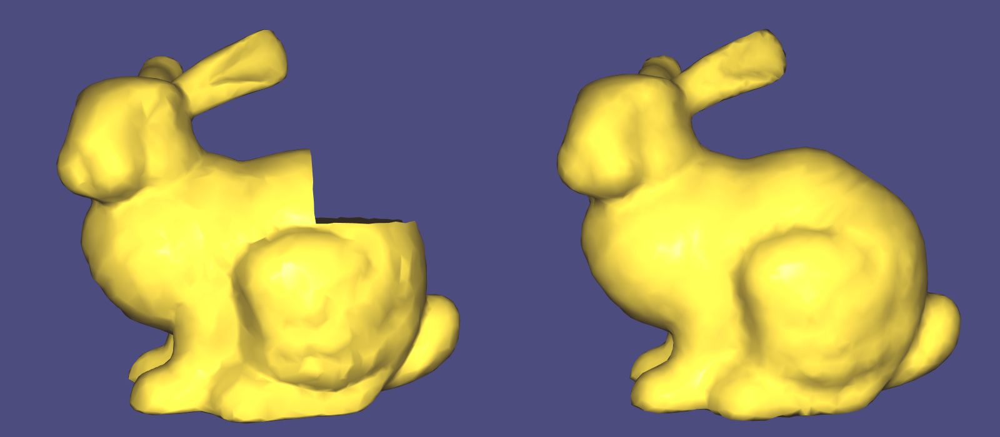
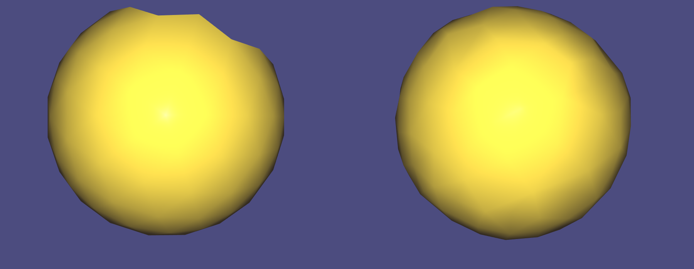

# hole_fixer - Demo implementation of smoothly filling holes in 3D meshes using surface fairing





An implementation of Surface Fairing, that demonstrates the concepts explained in 
[my article](https://erkaman.github.io/posts/hole_filling.html).

This demo program allows you to specify a broken mesh with a hole, that the program will fix.
By running the command line

```
hole_fixer -in bunnyhole.off -out out.off -outfaces 8000 -upsample 2
```

The above pictured bunny mesh will be fixed, and the fixed mesh is written to `out.off`.

NOTE: the implementation is not by any means optimized, in order to keep it 
simple and readable.

## Building

The only dependencies are [libigl](https://github.com/libigl/libigl) and [Eigen](http://eigen.tuxfamily.org/index.php?title=Main_Page).
Both of which are included within this repository.

We use CMake for building. If on Linux or OS X, you can build it in the terminal by doing something like:

```
mkdir build && cd build && cmake .. && make
```

If on Windows, create a `build/` folder, and run `cmake ..` from
inside that folder. This will create a visual studio solution(if you
have visual studio). Launch that solution, and then simply compile the
project named `hole_fixer`.
